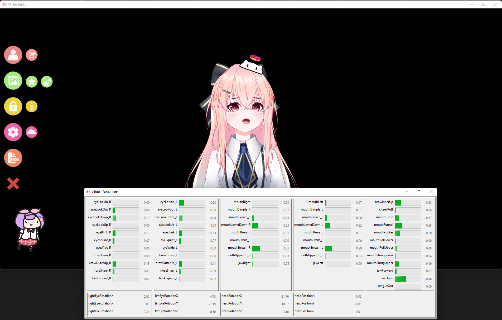

# VTube-IFacial-Link

一个 *VTube Studio* 插件，从 *iFacialMocap*（IOS）桥接面部跟踪，实现完整的苹果 ARKit 面部跟踪功能。

|  |  |
|---|---|

## 快速开始指南

*注意：该程序是在 Python 3.8.10 上开发的*。

1. 克隆代码库。
2. 运行命令 `pip install -r requirements.txt` 来恢复所有的依赖项。
3. 确保你的 iPhone 和电脑都在同一个网络上。
4. 在你的电脑上启动 VtubeStudio，在你的 iPhone 上启动 iFacialMocap。
5. 确保 "VTube Studio API" 被启用，端口应该是8001。
6. 通过命令 `python main.py -c <iPhone的IP地址>` 启动桥接插件，其中 `<iPhone的IP地址>` 是 iFacialMocap 中显示的地址。
7. 你应该看到一个显示所有捕获参数的窗口，VtubeStudio 应该检测到该插件。

## 支持的参数

### VTube Studio 预设

- FacePositionX
- FacePositionY
- FacePositionZ
- FaceAngleX
- FaceAngleY
- FaceAngleZ
- MouthSmile
- MouthOpen
- Brows
- TongueOut
- EyeOpenLeft
- EyeOpenRight
- EyeLeftX
- EyeLeftY
- EyeRightX
- EyeRightY
- CheekPuff
- FaceAngry
- BrowLeftY
- BrowRightY
- MouthX

### 自定义参数 (ARKit)

- EyeBlinkLeft
- EyeLookDownLeft
- EyeLookInLeft
- EyeLookOutLeft
- EyeLookUpLeft
- EyeSquintLeft
- EyeWideLeft
- EyeBlinkRight
- EyeLookDownRight
- EyeLookInRight
- EyeLookOutRight
- EyeLookUpRight
- EyeSquintRight
- EyeWideRight
- JawForward
- JawLeft
- JawRight
- JawOpen
- MouthClose
- MouthFunnel
- MouthPucker
- MouthLeft
- MouthRight
- MouthSmileLeft
- MouthSmileRight
- MouthFrownLeft
- MouthFrownRight
- MouthDimpleLeft
- MouthDimpleRight
- MouthStretchLeft
- MouthStretchRight
- MouthRollLower
- MouthRollUpper
- MouthShrugLower
- MouthShrugUpper
- MouthPressLeft
- MouthPressRight
- MouthLowerDownLeft
- MouthLowerDownRight
- MouthUpperUpLeft
- MouthUpperUpRight
- BrowDownLeft
- BrowDownRight
- BrowInnerUp
- BrowOuterUpLeft
- BrowOuterUpRight
- CheekPuff
- CheekSquintLeft
- CheekSquintRight
- NoseSneerLeft
- NoseSneerRight
- TongueOut

## 路线图

- [ ] 使用 ML 模型，从多个参数中检测微笑和愤怒。
- [ ] 在IOS上建立一个独立的人脸追踪链接应用。 [ref](https://developer.apple.com/documentation/arkit/content_anchors/tracking_and_visualizing_faces)
- [ ] 手部追踪功能。 [ref-1](https://developer.apple.com/videos/play/wwdc2020/10653/) [ref-2](https://developer.apple.com/documentation/vision/detecting_hand_poses_with_vision)

## 致谢

截图中的模型是由 [猫旦那](https://www.bilibili.com/video/BV1yo4y1f7Xe) 创建的。